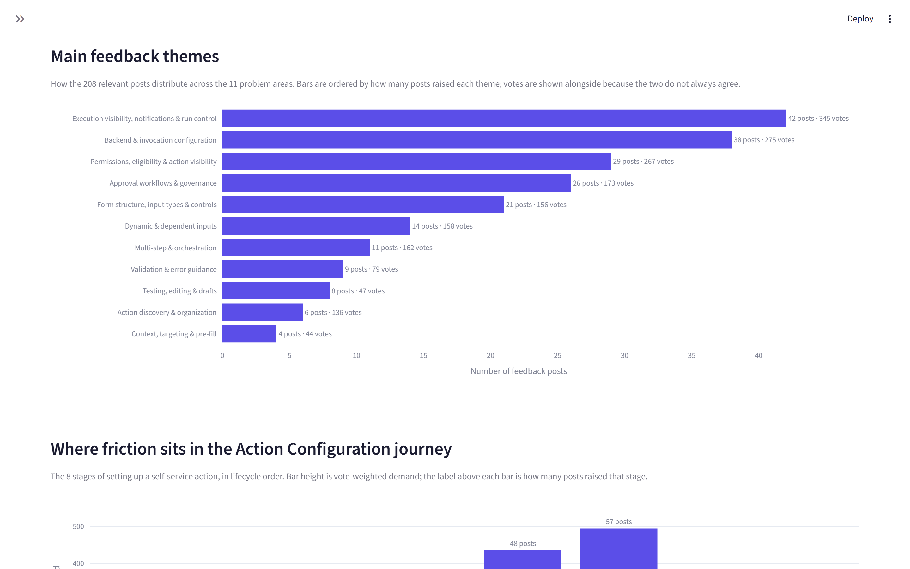
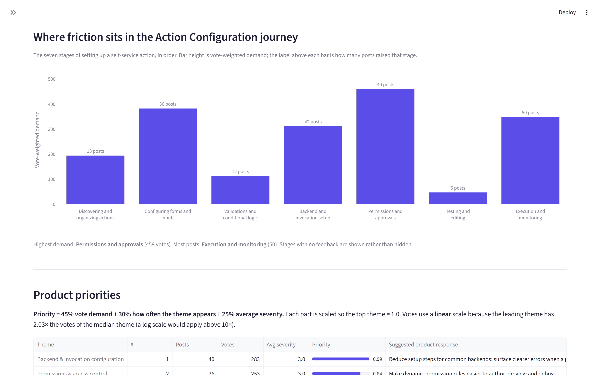
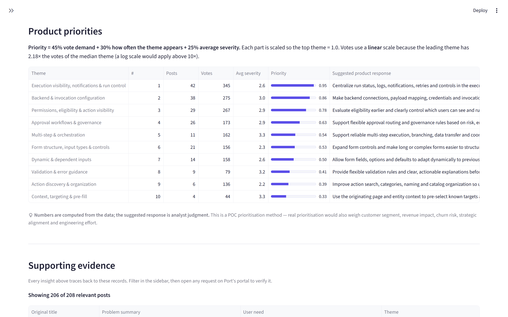
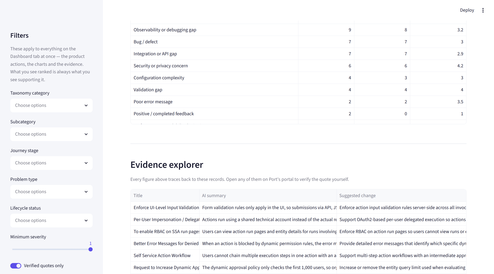
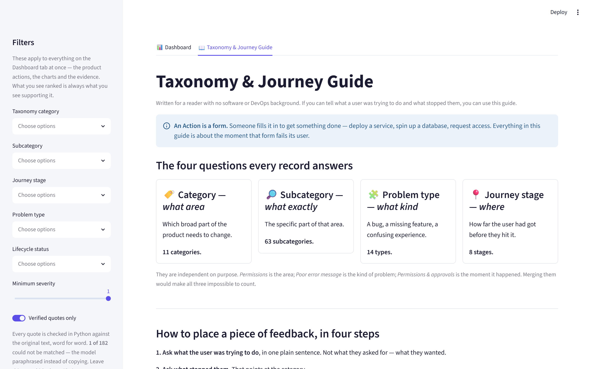
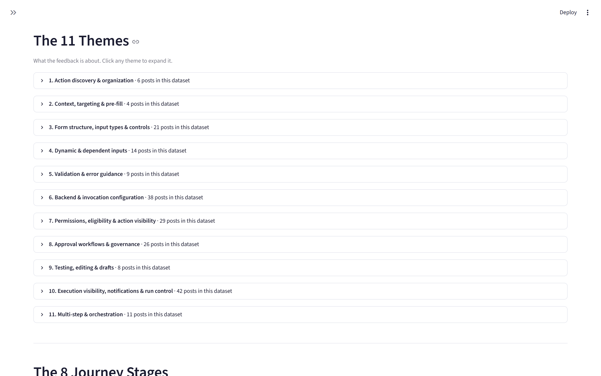
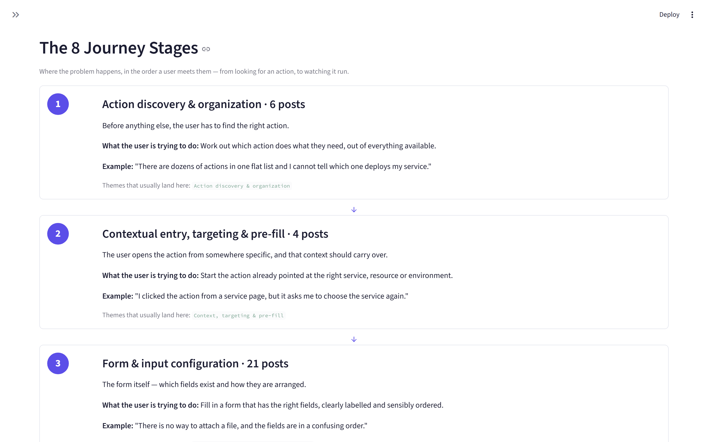
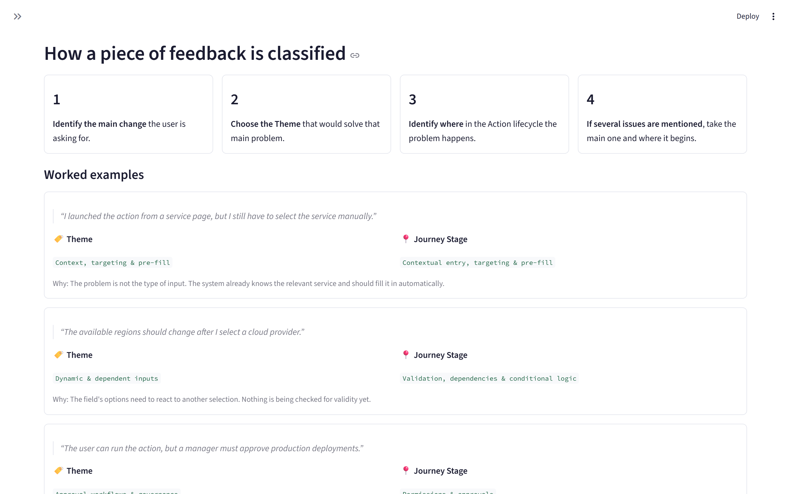

# Port Action Feedback Intelligence

**Turning 327 public feature requests into a ranked, evidence-backed view of where developers get stuck configuring Port actions.**

> An independent take-home project for Port's Product Analyst challenge (Part 2: AI-Augmented Qualitative Analysis).
> **Not an official Port product.** Not affiliated with or endorsed by Port. Built entirely from publicly available data.

---

## The business problem

Port's assignment states it directly:

> *"while many users start configuring an action, there is a significant drop-off before they reach their first successful trigger."*

**Part 1** measures that drop-off — conversion rate, setup time, retries before success. It tells you **where** users fall out.

It cannot tell you **why**.

This project reads what users actually say, and produces an answer that a product team can act on — where every claim traces back to a real request with a clickable link.

---

## What it found

Running end to end on **208 relevant feature requests carrying 1,842 votes**, classified under the v2.0 taxonomy:

| Finding | Evidence |
|---|---|
| **Execution visibility, notifications & run control is the single biggest gap.** It leads on both volume *and* demand, so it is not an artefact of a few loud requests. | 42 posts · 345 votes · avg severity 2.6 |
| **Counting complaints and counting demand give different roadmaps.** *Permissions & approvals* generates the most posts, but *Action discovery & organization* attracts **2.6× the demand per post** from a fraction of the volume. | 57 posts @ 8.7 votes each vs 6 posts @ 22.7 votes each |
| **Permissions & approvals carries the most demand of any journey stage** — and splits into two separate themes that *both* land in the top four priorities. | 494 votes across 57 posts |

**Priority ranking** (45% demand, 30% frequency, 25% severity):

| # | Theme | Posts | Votes | Avg sev | Score |
|---|---|---|---|---|---|
| 1 | Execution visibility, notifications & run control | 42 | 345 | 2.6 | 0.950 |
| 2 | Backend & invocation configuration | 38 | 275 | 3.0 | 0.859 |
| 3 | Permissions, eligibility & action visibility | 29 | 267 | 2.9 | 0.777 |
| 4 | Approval workflows & governance | 26 | 173 | 2.9 | 0.635 |
| 5 | Multi-step & orchestration | 11 | 162 | 3.3 | 0.540 |

**Journey stages** in lifecycle order — the two newest stages sit at positions 1–2, and both show unusually high demand density:

| # | Stage | Posts | Votes | Votes/post |
|---|---|---|---|---|
| 1 | Action discovery & organization | 6 | 136 | **22.7** |
| 2 | Contextual entry, targeting & pre-fill | 4 | 44 | 11.0 |
| 3 | Form & input configuration | 21 | 156 | 7.4 |
| 4 | Validation, dependencies & conditional logic | 23 | 237 | 10.3 |
| 5 | Backend & invocation setup | 48 | 435 | 9.1 |
| 6 | Permissions & approvals | **57** | **494** | 8.7 |
| 7 | Testing, editing & publishing | 8 | 47 | 5.9 |
| 8 | Execution, monitoring & run control | 41 | 293 | 7.1 |

---

## The app

Two tabs. **Dashboard** — the analysis, five sections, understandable in about two minutes. **Themes & Journey Stages Guide** — a plain-language reference so a non-technical reader can check the classifications rather than take them on trust.

### Tab 1 — Dashboard


*Five KPIs, then three findings — each stating its own sample size.*



*Themes ordered by how often they are raised, with votes alongside — the two do not always agree.*



*Vote-weighted demand across the eight stages of setting up an action, in chronological lifecycle order.*



*Ranked themes with the scoring formula stated in one sentence. Computed numbers and analyst judgment are visually separated.*



*Every insight traces to these records. Filterable, with a verbatim quote and a clickable link to the original request on Port's portal. Journey-stage filter options appear in chronological lifecycle order, not alphabetically.*

### Tab 2 — Themes & Journey Stages Guide



*Explains what an Action is, and why every record carries two labels rather than one.*



*All 11 themes, each with a plain-language meaning, use-when and do-not-use-when criteria, two real examples, and its usual journey stage.*



*The 8 stages as a numbered timeline in lifecycle order, with live post counts from the current dataset.*



*Four worked classification examples, plus the side-by-side pairs that are most commonly confused.*

---

## Architecture

```
   THIS POC
   ┌──────────────────┐
   │ Port public      │
   │ feature portal   │──▶ Cleaning ──▶ AI categorisation ──▶ Aggregation ──▶ Streamlit
   │ roadmap.port.io  │    dedupe        schema + grounding    plain Python    dashboard
   └──────────────────┘

   AT PRODUCTION SCALE (explained, not implemented)
   ┌──────────────────┐
   │ Slack  │ Zendesk │──▶ Cleaning ──▶ AI categorisation ──▶ Aggregation ──▶ Product
   │        │  Gong   │                                                        dashboard
   └──────────────────┘
```

**The division of labour is the point:**

| Concern | Owner |
|---|---|
| Reading, summarising, categorising feedback | **LLM** |
| Counts, totals, averages, rankings, priority scores | **Plain Python** |

No number in the dashboard was produced by a language model.

---

## How the data was collected

**Source:** [roadmap.port.io](https://roadmap.port.io/) — Port's public feature-request board (Canny), 1,483 posts.

**Compliance:** `robots.txt` returns `User-agent: * / Disallow:` — unconditional permission. No authentication exists on the board and nothing was bypassed. A 2-second delay was self-imposed anyway, single-threaded, with an identifying User-Agent.

**Method:** every page server-renders a `window.__data` JSON blob containing complete post records, so collection is an HTTP GET plus a JSON parse — no headless browser, no HTML scraping, and lighter on Port's servers than either.

**The hard part was discovery, not extraction.** List views render only 10 posts at a time and `?page=2` is ignored. Three sources combined:

| Source | Yield |
|---|---|
| Roadmap view (`/`) | ~51 slugs per request |
| List views (`category × sort`) | 10 each |
| **Keyword search** (`?search=`), 27 terms tracking the journey stages | 10 each |

Search was decisive: candidates went from **141 → 327**, and Self-service actions records from **24 → 125**.

**Result:** 327 posts, 0 fetch failures, 0 duplicates (verified with three independent keys — post ID, canonical URL, and normalised text hash — each tested against planted duplicates).

**Privacy:** author IDs and voter identities are never collected. Emails and @-mentions in body text are redacted at collection time.

---

## How the LLM categorised it

Each post is classified independently against a **taxonomy defined before any data was scored** (see [`TAXONOMY.md`](TAXONOMY.md)): **11 themes × 8 journey stages × 5 feedback types**, plus a 1–5 severity scale.

A **theme** answers *what product problem is this?*; a **journey stage** answers *where in the action lifecycle does the user hit it?* Stages are in chronological lifecycle order and mirror Port's own self-service flow, so a finding like *"friction concentrates in permissions and approvals"* points at a surface the team already owns.

Each relevant record gets exactly **one** theme and **one** stage — no secondary classifications. Where a record could reasonably go two ways, eleven documented tie-break rules decide, and residual uncertainty is reported through `confidence` rather than hidden.

The app's second tab, **Themes & Journey Stages Guide**, explains all of this in plain language for readers with no software or DevOps background.

The model returns 9 fields under a strict schema: `is_relevant`, `primary_theme`, `journey_stage`, `feedback_type`, `severity`, `short_summary`, `user_need`, `confidence`, `evidence_excerpt`.

### Three controls that keep it honest

**1. Closed enums.** Every categorical field is a Pydantic `Literal` built from the taxonomy. An invented label fails validation rather than quietly entering the dataset. Verified: made-up themes, severity 9, confidence 1.4, and even a stage name with a trailing space are all rejected.

**2. Quote grounding.** Every `evidence_excerpt` is checked **in Python** as an exact substring of the source text. Only the verified portion is stored, so anything displayed is guaranteed verbatim. **The model cannot attribute a complaint to a customer who never made it, because it cannot produce a quote that is not in the source.** Result: 206 of 208 relevant records carry a verified quote; the 2 that failed are excluded from display, not shown.

**3. Confidence never affects priority.** It measures the model's certainty, not how much a problem matters. Letting it raise a score would mean well-phrased feedback outranks urgent-but-ambiguous feedback. It is reported separately as a quality signal; 13 records fall below 0.7 and are flagged rather than hidden.

**Reproducibility, stated honestly.** `temperature` no longer exists on current models, so run-to-run identical output is not achievable. Consistency comes from a fixed versioned prompt, closed enums, and low effort — and the real guarantee is that **classification results are committed to the repo**. The dashboard replays stored results rather than re-running the model.

---

## How the numbers are calculated

Everything below is plain pandas over the classified records — deterministic and reproducible.

**Priority score:**

```
priority = 0.45 × demand + 0.30 × frequency + 0.25 × severity
```

Each component is scaled so the leading theme = 1.0. Worked example:

> **Execution visibility, notifications & run control** — votes 345/345 = 1.000 × 0.45 = **0.450** · posts 42/42 = 1.000 × 0.30 = **0.300** · severity 2.62/3.27 = 0.800 × 0.25 = **0.200** → **0.950**
>
> (The 3.27 severity denominator is *Multi-step & orchestration*, the highest-severity theme — each component is scaled against whichever theme leads on that component.)

**Vote scaling is chosen by the data, not by hand.** A rule fixed in advance says: use a log scale if the top theme has more than 10× the median theme's votes. Measured ratio is **2.03×**, so a linear scale applies — and the dashboard says so. The code measures and reports the ratio either way, so the scale cannot be picked to flatter a chart.

**Share-of-max, not min-max.** Min-max would force the lowest theme to exactly 0 on every axis, manufacturing spread that isn't there — severity only ranges 2.3–3.1, so min-max would turn a trivial gap into the difference between 0 and 1.

All 12 scores were recomputed independently of the scoring code: **0 mismatches to 9 decimal places, 0 monotonicity violations.**

---

## Evaluation

A reproducible 15-record sample (fixed seed, 9 relevant + 6 irrelevant) sits at [`data/evaluation/review_sample.csv`](data/evaluation/review_sample.csv) for manual checking.

**Every metric currently reports "Not yet evaluated."** There is no code path that can produce an accuracy figure without real human labels. Including irrelevant records is deliberate — a sample of only relevant posts cannot detect over-inclusion.

With 15 records this is a **sanity check, not a statistically robust evaluation**: enough to catch a taxonomy category nobody can apply consistently, not enough to quote an accuracy number with confidence.

---

## Limitations

Worth reading before believing any of the findings.

- **A feature-request board shapes what you find.** 185 of 208 relevant records (88%) are feature requests; only 14 are bugs and 7 usability friction. People come to a roadmap board to *ask for things*, not to report friction. Zendesk tickets and Gong calls would surface bug and usability signal this source structurally cannot.
- **Votes measure vocal demand, not revenue or customer count.** One vote from an enterprise account counts the same as one from a trial user.
- **Severity is judged from text alone** and clusters at 3 (111 of 208), so it discriminates weakly here.
- **Parent posts are sometimes written by Port staff**, not customers — curated roll-ups that read like product copy, with the genuine customer voice in the merged child requests. The classifier is told to categorise the underlying problem and prefer quoting problem statements, but the collector currently captures parent posts only. Vote totals already aggregate merged children, so demand signal is unaffected.
- **Public feedback cannot prove causation.** It explains why users *say* they struggle. It cannot prove that is why they drop off.
- **327 posts is a POC, not Port's full feedback volume.**

---

## Connection to Part 1

| | Question | Method |
|---|---|---|
| **Part 1** | *Where* do users drop off? | Conversion rate, setup time, retries before success |
| **Part 2** | *Why* do they struggle? | Themed, ranked customer feedback |

The two combine as **hypotheses to test, not conclusions**. For example: if Part 1 shows retries concentrated in a particular action type, and Part 2 shows *Execution visibility, notifications & run control* as the top theme, that is a testable hypothesis — users may be retrying because they cannot tell what went wrong the first time. Worth validating against internal telemetry.

**No internal Port metrics are invented here, and no causal claim is made.** Public feedback and internal funnel data are different evidence types; joining them is the next step, not something this POC can do.

---

## Running it

```bash
pip install -r requirements.txt
streamlit run app.py
```

**The app needs no API key and makes no network calls.** Classification results are committed, so it opens and renders identically on any machine.

To re-run the pipeline (requires an Anthropic API key in `.env` — see `.env.example`):

```bash
python -m src.collectors.run       # collect from the portal
python -m src.analysis.clean       # dedupe + quality gates
python -m src.analysis.classify    # LLM classification (cached, resumable)
python -m src.analysis.aggregate   # scoring
python -m src.analysis.evaluate    # agreement, once labelled
```

Every stage is independently re-runnable from the previous stage's output. Classification is cached per record, so an interrupted run resumes instead of restarting.

---

## Scaling to Slack, Zendesk, and Gong

Explained here, **not implemented**.

| This POC | Production |
|---|---|
| One public portal | A connector per source, each with its own auth, schema, and volume profile |
| Votes as the demand signal | Customer segment, ARR, churn risk, strategic alignment, engineering effort |
| Fixed taxonomy, one LLM call per record | **Embedding-based clustering to discover themes**, LLM to label and summarise them |
| Files (CSV/JSON) | Warehouse table + object storage for raw payloads |
| Manual pipeline run | Scheduled ingestion with monitoring and alerting |
| 15-record spot check | Stratified sample per batch, two reviewers, inter-annotator agreement, frozen gold set for regression-testing prompt changes |
| Public feedback only | Joined to internal telemetry — the Part 1 funnel |

**Why a fixed taxonomy is right here and wrong at scale.** With ~200 records, a taxonomy drawn from Port's own documentation produces findings that point at pages the team already owns, and every record can be inspected by hand. Clustering 200 records yields unstable, hard-to-interpret groups. At thousands of records the trade reverses: a fixed taxonomy cannot discover a theme nobody thought to name, and per-record LLM calls stop being economic. Embeddings find the unknown unknowns; the LLM then labels what was found.

**Source-specific handling** would matter too: Slack is conversational and needs thread reconstruction; Zendesk has structured metadata and resolution outcomes; Gong is transcribed speech where the speaker's role changes how a statement should be weighted.

---

## Project structure

```
app.py                     Streamlit app: Dashboard tab + Guide tab
src/
  collectors/              portal fetch, slug discovery, parsing
  models/                  taxonomy, Pydantic schema, versioned prompt
  analysis/                clean, classify, aggregate, evaluate
data/
  raw/                     immutable snapshot -- write once
  processed/               clean + analysed data (the app's only input)
  evaluation/              review sample
tests/                     essential checks
docs/                      collection feasibility report
```

Nothing under `src/` imports Streamlit, so all analysis logic is testable without running the app.

---

## Attribution

- **Data:** publicly available feature requests from [roadmap.port.io](https://roadmap.port.io/), collected in compliance with `robots.txt`. Every record retains its original source URL. Port trademarks and content belong to Port.
- **Product context:** [Port documentation](https://docs.port.io/workflows/actions-and-automations/create-self-service-experiences/).
- **Built with:** Streamlit, pandas, Plotly, Pydantic, and the Anthropic SDK — see `requirements.txt`.
- **Licence:** provided as an interview deliverable. Collected data remains the property of its original authors and Port.
