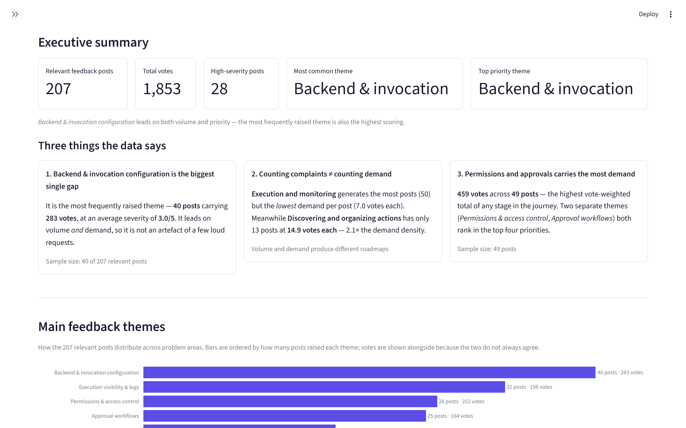
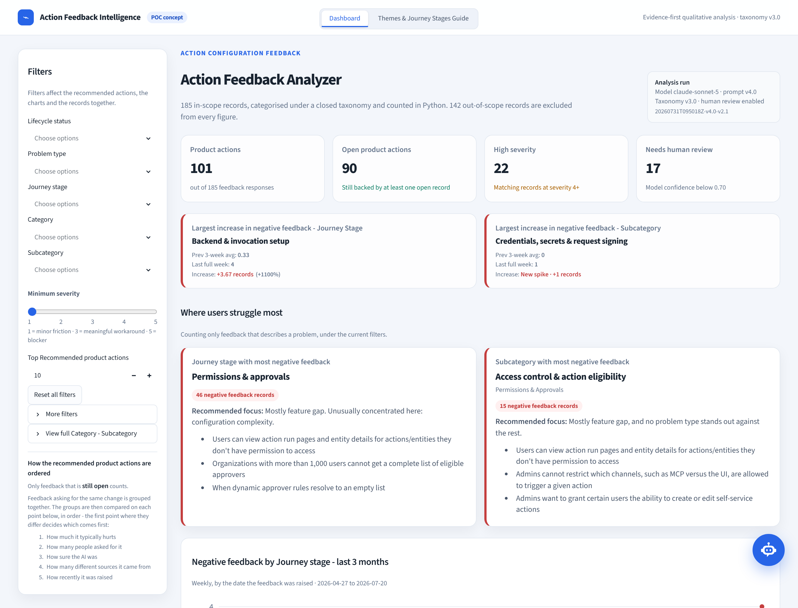
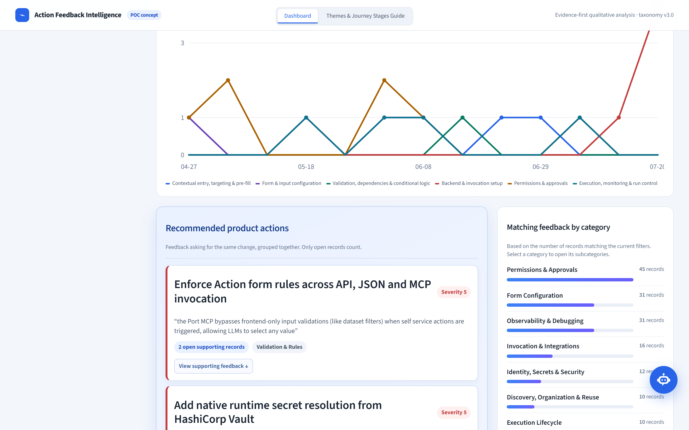
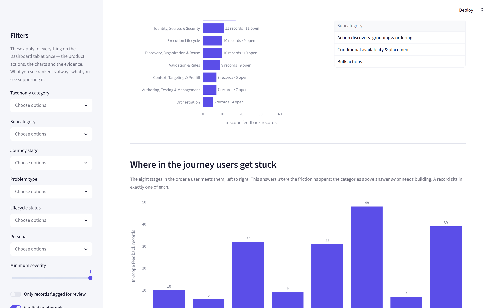
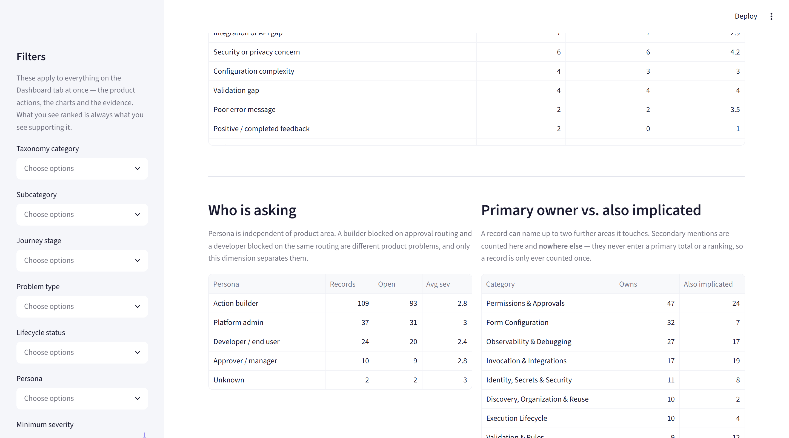
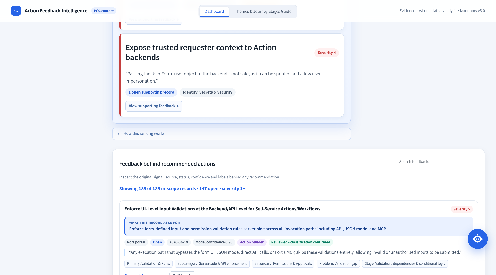
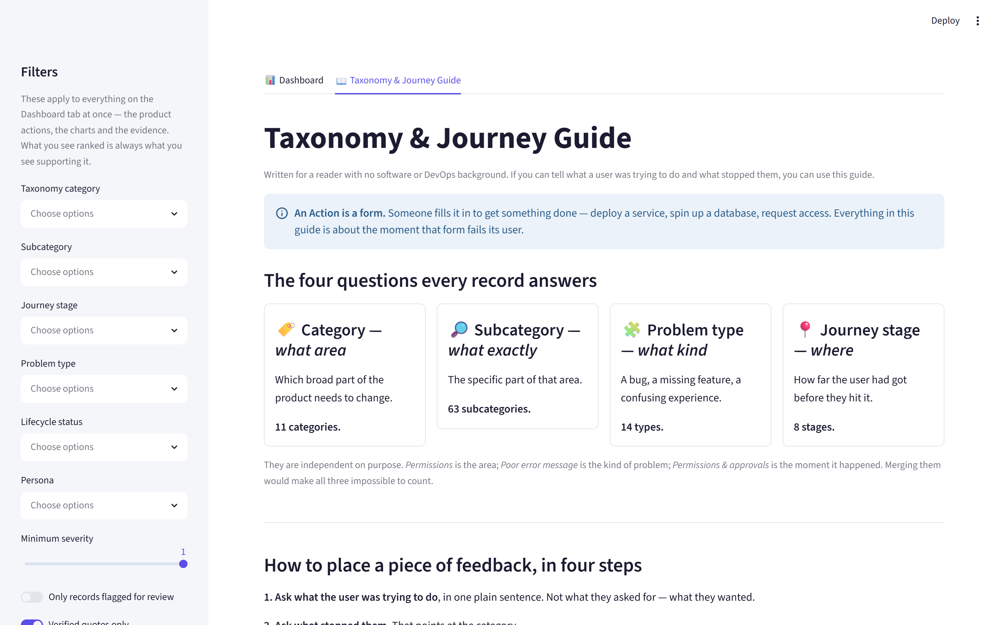
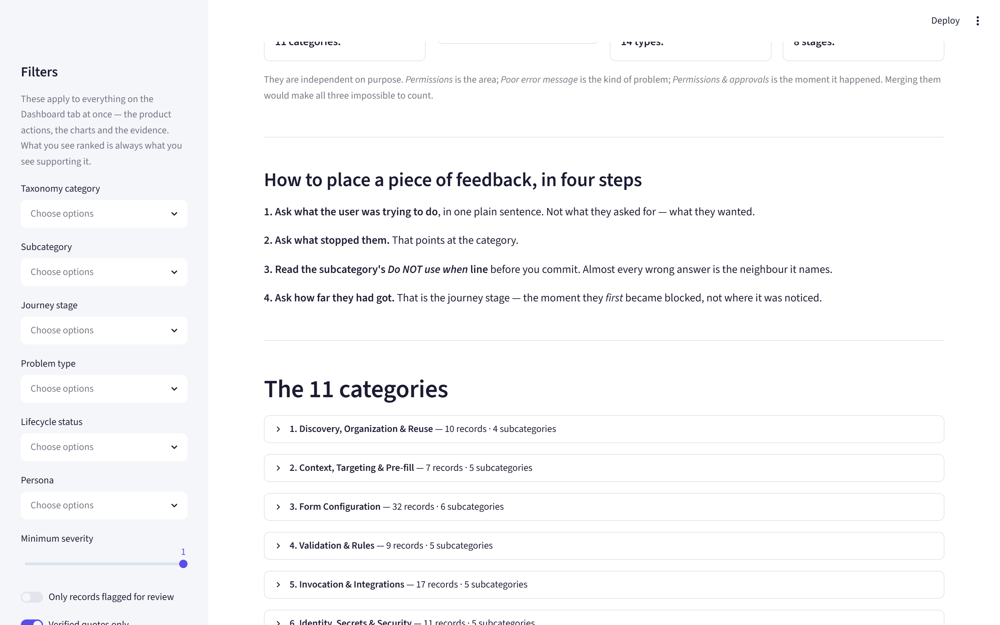
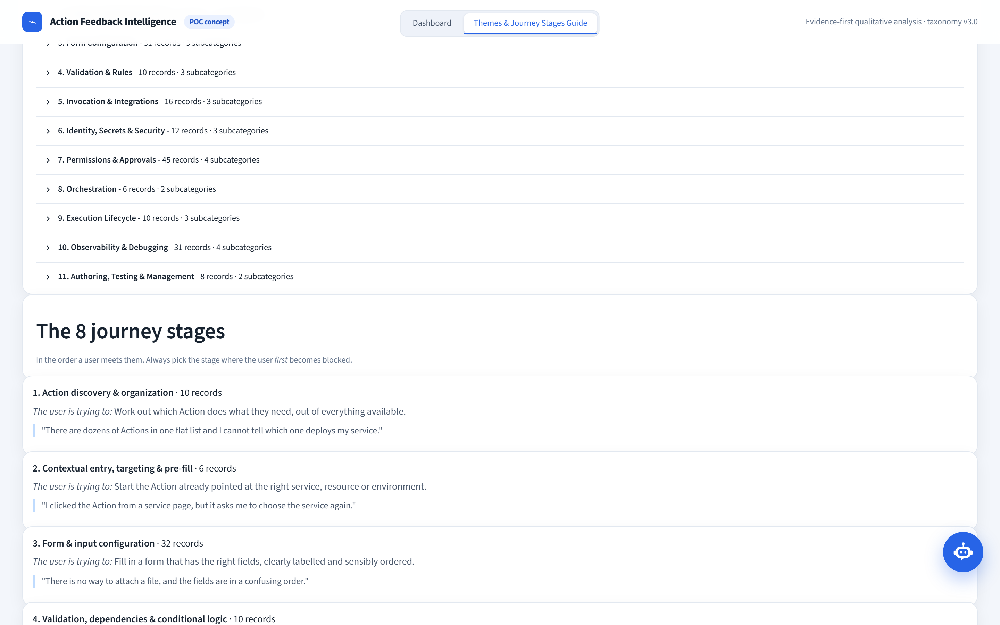
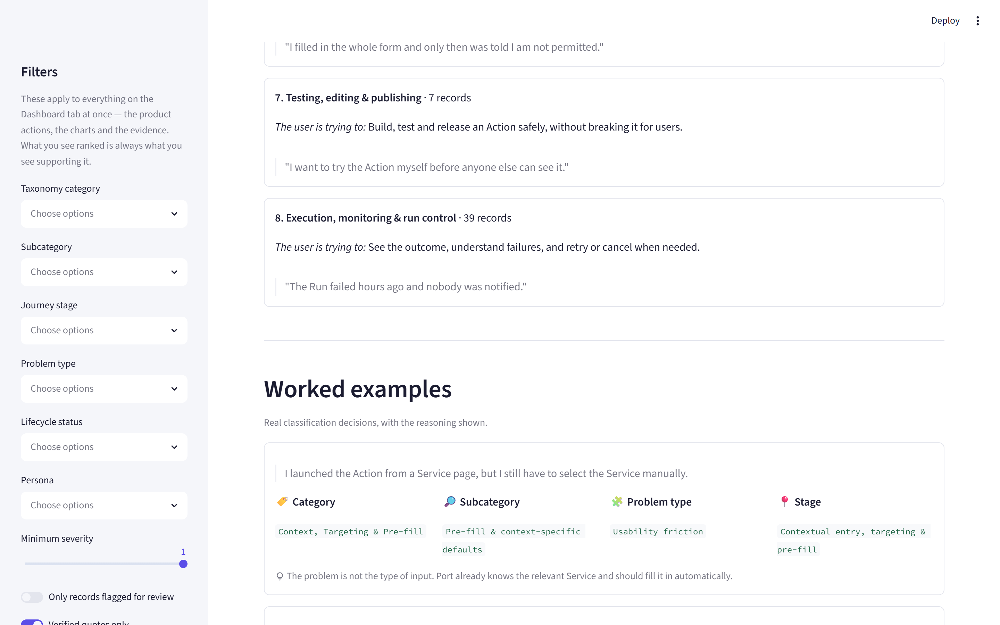

# Port Action Feedback Intelligence

**Turning 327 public feature requests into a ranked, evidence-backed list of what to build next for Port Actions — where every recommendation opens onto the records that argue for it.**

> An independent take-home project for Port's Product Analyst challenge (Part 2: AI-Augmented Qualitative Analysis).
> **Not an official Port product.** Not affiliated with or endorsed by Port. Built entirely from publicly available data.
>
> The assignment asks two design questions before asking for the POC: *"Explain how you would design such a system?"* and *"Explain how you would use GenAI (LLMs) to categorize this unstructured data?"* Both are answered here: the system design in [`ARCHITECTURE.md`](ARCHITECTURE.md), and the categorisation approach under [How the LLM categorised it](#how-the-llm-categorised-it) below, with the full taxonomy in [`TAXONOMY.md`](TAXONOMY.md).

---

## The business problem

Port's assignment states it directly:

> *"while many users start configuring an action, there is a significant drop-off before they reach their first successful trigger."*

**Part 1** measures that drop-off — conversion rate, setup time, retries before success. It tells you **where** users fall out.

It cannot tell you **why**.

This project reads what users actually say, and produces an answer that a product team can act on — where every claim traces back to a real request with a clickable link.

---

## What it found

Running end to end on **327 collected records**, of which **182 are in scope** for Action Configuration under the v2.0 hierarchical taxonomy. The other **145 were excluded with a stated reason** — catalog modelling, scorecards, the platform-wide audit log, data-source sync — rather than padded into the dataset to inflate the totals.

| Finding | Evidence |
|---|---|
| **Permissions and approvals is the largest problem area, and it is not close.** It carries more in-scope records than the next area by 47%, and produces four of the top twelve recommended actions. | 47 records · 37 still open |
| **The single most-supported change is a security one.** Ten open records describe users seeing action runs and entity details they should not have access to. | 10 open records · avg severity 3.5 |
| **This board reports missing capability, not broken capability.** 128 of 182 in-scope records are feature gaps; only 7 are defects. A roadmap board is where people come to *ask for things* — Zendesk and Gong would surface the bug and usability signal this source structurally cannot. | 128 feature gap · 11 usability friction · 7 bug |
| **Friction concentrates at three moments, not across the whole journey.** Permissions & approvals, execution/monitoring, and form configuration hold 119 of 182 records between them. | 48 · 39 · 32 records |

**Top recommended product actions** — ranked from open records only, so shipped work cannot argue for itself again:

| # | Open records | Avg sev | Product action | Area |
|---|---|---|---|---|
| 1 | **10** | 3.5 | Enforce RBAC on action run pages so users cannot view runs or entity details they lack permission to access | Permissions & Approvals › RBAC & dynamic permissions |
| 2 | 8 | 2.8 | Enable approvers to edit action input values during the manual approval step | Permissions & Approvals › Approver experience |
| 3 | 7 | 2.4 | Provide real-time streaming of action run logs in the UI as the run executes | Observability & Debugging › Logs & log streaming |
| 4 | 6 | 2.3 | Show the actor (user, integration, or system) behind each run on the run page and in the audit log | Observability & Debugging › Run history & audit |
| 5 | 6 | 2.5 | Add further file formats and free-text/markdown input types to action form fields | Form Configuration › Input types & controls |

54 recommended actions in total, each traceable to its supporting records.

**Where the problems sit** — 11 product areas, in-scope records:

| Category | Records | Open |
|---|---|---|
| Permissions & Approvals | **47** | 37 |
| Form Configuration | 32 | 25 |
| Observability & Debugging | 27 | 24 |
| Invocation & Integrations | 17 | 14 |
| Identity, Secrets & Security | 11 | 11 |
| Discovery, Organization & Reuse | 10 | 10 |
| Execution Lifecycle | 10 | 9 |
| Validation & Rules | 9 | 9 |
| Authoring, Testing & Management | 7 | 7 |
| Context, Targeting & Pre-fill | 7 | 5 |
| Orchestration | 5 | 4 |

**Journey stages** in lifecycle order — *where* users get stuck, as opposed to *what* needs building:

| # | Stage | Records | Open |
|---|---|---|---|
| 1 | Action discovery & organization | 10 | 10 |
| 2 | Contextual entry, targeting & pre-fill | 6 | 4 |
| 3 | Form & input configuration | 32 | 25 |
| 4 | Validation, dependencies & conditional logic | 9 | 9 |
| 5 | Backend & invocation setup | 31 | 27 |
| 6 | Permissions & approvals | **48** | 38 |
| 7 | Testing, editing & publishing | 7 | 7 |
| 8 | Execution, monitoring & run control | 39 | 35 |

---

## The app

Two tabs. **Dashboard** — ranked product actions, each opening onto its supporting feedback, plus distribution charts and a full evidence explorer. **Taxonomy & Journey Guide** — a plain-language reference so a non-technical reader can check the classifications rather than take them on trust.

A floating **Product Data Assistant** sits over both, answering ten predefined questions with deterministic Python — no model, no tokens. See [Deterministic Product Data Assistant](#deterministic-product-data-assistant).

### Tab 1 — Dashboard



*Four KPIs. Scope is stated up front — 327 collected, 182 in scope, 145 excluded — so the denominator behind every later figure is visible before any chart is.*

**A second row, directly below, surfaces what is rising fastest: *Largest increase in negative feedback - Journey Stage* on the left, *- Subcategory* on the right.** Each spans the width of two KPI cards plus the gap between them, so the two rows share the same left and right edges. Both compare the **last completed Monday-Sunday week** against the **average of the three completed weeks before it**, counting only Negative records by `created_at`, and following the dashboard filters like everything else.

**Ranked by absolute increase, not by percentage.** `last_full_week_count - previous_3_week_average` decides the winner; growth percentage is shown beside it as context only. A group going from 1 record to 4 is a real but tiny signal, and ranking it above a group that went from 20 to 30 — ten more genuine complaints — just because the first group started smaller would be reporting the size of the denominator, not the size of the problem.

The week in progress is deliberately excluded. Counting a partial week against full ones would report a collapse every Monday and a surge every Sunday — an artefact of when the page was opened, not a trend.

Three cases the arithmetic cannot express are handled rather than printed:

| Situation | Shown |
|---|---|
| Baseline is 0, last week > 0 | **New spike · +N records** — a percentage against zero is not a number, so none is shown |
| No positive increase | Not surfaced — flat or falling is not "growing feedback" |
| No negative records in scope | *No recent negative trend* |

The increase is red because it is the number the ranking is built on; the percentage next to it stays a muted, smaller supporting fact rather than competing with it for attention.

**"Needs human review" keeps its card in the original four-KPI row.** Its classification, filter, and card badge were never touched — the trend cards live in their own row below rather than displacing it.



*Ranked product actions, each stating its open-record count and severity, each naming its category and subcategory, and each expanding to the verified quotes behind it. The ranking keys are rendered from the same constant the code ranks by, so the explanation cannot drift from the behaviour.*



*The 11 product areas ordered by how often they are raised, with a live drill-down into whichever of the 63 subcategories appear inside the selected one.*



*Where friction falls across the eight stages of setting up an action, heaviest stage first. Stages on the same count stay in chronological lifecycle order, and stages with no feedback are shown rather than dropped — an empty stage is a finding, not a gap in the chart.*



*Who is asking, and which areas get pulled into other areas' problems. **Invocation & Integrations owns 17 records but is named as a contributing area in 19**, and Validation & Rules owns 9 against 12 — both are dragged into other teams' feedback more than they generate their own. Secondary mentions are counted in their own column and never enter a primary total or a ranking, so no record is counted twice.*



*Every figure traces to these records: AI summary, suggested change, every label the record carries — including any secondary areas it touches — and a verbatim quote with a clickable link to the original request on Port's portal.*

### Tab 2 — Taxonomy & Journey Guide



*Explains what an Action is, why every record carries four independent labels rather than one, and how to place a record in four steps.*



*All 11 categories and their 63 subcategories, each with a plain-language meaning, use-for triggers, an explicit do-not-use-when rule surfaced as a warning, real examples, and live record counts from the current dataset.*



*The 8 stages as a numbered timeline in lifecycle order, each with what the user was trying to do and a live record count.*



*Eight worked classification examples with the reasoning shown, plus the eight side-by-side pairs that are most commonly confused.*

---

## Architecture

```
   THIS POC
   ┌──────────────────┐
   │ Port public      │
   │ feature portal   │──▶ Cleaning ──▶ AI categorisation ──▶ Aggregation ──▶ Streamlit
   │ roadmap.port.io  │    dedupe        schema + grounding    plain Python    dashboard
   └──────────────────┘

   AT PRODUCTION SCALE (explained, not implemented)
   ┌──────────────────┐
   │ Slack  │ Zendesk │──▶ Cleaning ──▶ AI categorisation ──▶ Aggregation ──▶ Product
   │        │  Gong   │                                                        dashboard
   └──────────────────┘
```

**The division of labour is the point:**

| Concern | Owner |
|---|---|
| Reading, summarising, categorising feedback | **LLM** |
| Counts, totals, averages, rankings | **Plain Python** |

No number in the dashboard was produced by a language model.

---

## How the data was collected

**Source:** [roadmap.port.io](https://roadmap.port.io/) — Port's public feature-request board (Canny), 1,483 posts.

**Compliance:** `robots.txt` returns `User-agent: * / Disallow:` — unconditional permission. No authentication exists on the board and nothing was bypassed. A 2-second delay was self-imposed anyway, single-threaded, with an identifying User-Agent.

**Method:** every page server-renders a `window.__data` JSON blob containing complete post records, so collection is an HTTP GET plus a JSON parse — no headless browser, no HTML scraping, and lighter on Port's servers than either.

**The hard part was discovery, not extraction.** List views render only 10 posts at a time and `?page=2` is ignored. Three sources combined:

| Source | Yield |
|---|---|
| Roadmap view (`/`) | ~51 slugs per request |
| List views (`category × sort`) | 10 each |
| **Keyword search** (`?search=`), 27 terms tracking the journey stages | 10 each |

Search was decisive: candidates went from **141 → 327**, and Self-service actions records from **24 → 125**.

**Result:** 327 posts, 0 fetch failures, 0 duplicates (verified with three independent keys — post ID, canonical URL, and normalised text hash — each tested against planted duplicates).

**Privacy:** author IDs and voter identities are never collected. Emails and @-mentions in body text are redacted at collection time.

---

## How the LLM categorised it

Each record is classified independently against a **taxonomy defined before any data was scored** (see [`TAXONOMY.md`](TAXONOMY.md), which is *generated from the taxonomy module* so it cannot describe a scheme the code does not implement).

**Four independent dimensions**, and the reason there are four rather than one is the central design point:

| Dimension | Question | Count |
|---|---|---|
| Category | *Which broad product area?* | 11 |
| Subcategory | *Which specific part of it?* | 63 |
| Problem type | *What kind of problem?* | 14 |
| Journey stage | *Where in the lifecycle?* | 8 |

A dynamic-permission failure belongs to **Permissions & Approvals** while its problem *type* is **Poor error message**. Folding those into one field makes both unusable for counting and quietly forces the analyst to discard one of the two facts. Severity, persona, lifecycle status and source system are further independent dimensions, never folded into a category name.

The stages mirror Port's own self-service flow, so a finding like *"friction concentrates in permissions and approvals"* points at a surface the team already owns. Chronological order is the canonical order in `taxonomy.py` and still governs the guide, the trend legend and every tie; only the distribution chart sorts by volume, so the heaviest stage is the first thing read.

Each relevant record gets exactly **one** primary category/subcategory pair, one problem type and one stage. **At most two secondary assignments** are allowed for records that genuinely span areas — 102 of 182 carry one — and secondaries never affect any count or ranking, so adding one cannot inflate a total. Where a record could reasonably go two ways, thirteen documented tie-break rules decide, and residual uncertainty is reported through `confidence` and `needs_human_review` rather than hidden.

**Persona** is a fifth independent dimension: 109 records come from Action builders, 37 from platform admins, 24 from developers, 10 from approvers. The same subcategory can be a builder's problem and a developer's problem, and only this dimension tells them apart.

The app's second tab, **Taxonomy & Journey Guide**, explains all of this in plain language for readers with no software or DevOps background.

### Three controls that keep it honest

**1. Closed enums, plus a hierarchy check.** Every categorical field is a Pydantic `Literal` built from the taxonomy, so an invented label fails validation rather than quietly entering the dataset. A two-level taxonomy adds a second failure mode worth closing: a *real* subcategory paired with the *wrong* parent category. A model validator rejects that pair, so the model cannot assemble a plausible-looking but impossible classification. Scope is enforced structurally too — when `is_relevant` is false the validator *clears* the taxonomy fields, so out-of-scope feedback is incapable of reaching any total.

**2. Quote grounding.** Every `evidence_excerpt` is checked **in Python** as an exact substring of the source text. Only the verified portion is stored, so anything displayed is guaranteed verbatim. **The model cannot attribute a complaint to a customer who never made it, because it cannot produce a quote that is not in the source.** Result: 181 of 182 in-scope records carry a verified quote; the 1 that failed is excluded from display, not shown.

**3. Confidence is a quality signal, not a ranking input.** It measures the model's certainty, not how much a problem matters. Letting it drive ranking would mean well-phrased feedback outranks urgent-but-ambiguous feedback. It appears only as the fifth tie-breaker, used when four earlier keys are already identical; 18 records fall below 0.7 and 26 are flagged for human review — surfaced, not hidden.

**Reproducibility, stated honestly.** `temperature` no longer exists on current models, so run-to-run identical output is not achievable. Consistency comes from a fixed versioned prompt, closed enums, and low effort — and the real guarantee is that **classification results are committed to the repo**. The dashboard replays stored results rather than re-running the model.

---

## How the numbers are calculated

Everything below is plain pandas over the classified records — deterministic and reproducible.

**Ranking — deliberately not a formula.**

### Step 1 — what is eligible

| Filter | Effect |
|---|---|
| In scope only (`is_relevant`) | Out-of-scope feedback cannot reach any total |
| **`Open` only** | `Planned` and `In progress` mean the work is already committed; `Completed` and `Closed` have shipped or been dropped |

Only `Open` counts. Planned and In progress used to count as demand, which argued for building something Port had already started. Excluded records are not deleted — they stay in the evidence section, labelled with their status, where *"we already built this"* is itself a finding.

### Step 2 — how records become one product action

Feedback is grouped by **the change it asks for**, not by where it sits in the taxonomy.

This is the correction of a real defect. Product actions used to *be* taxonomy subcategories, so a card reading "4 open supporting records" opened onto every record in its subcategory. `Authentication & delegated execution` holds OAuth delegation, service accounts, JWT forwarding and impersonation controls — four different product changes presented as one recommendation.

Grouping now happens in [`src/analysis/grouping.py`](src/analysis/grouping.py): normalise the suggested change, then agglomerate on token overlap, **within a single subcategory**. The subcategory is no longer the group — it is a fence that stops "templates for approval policies" merging with "templates for form layouts" on the shared word *templates*.

Every group stores its membership explicitly:

| Field | Meaning |
|---|---|
| `product_action_id` | Stable slug, used by the drill-down |
| `product_action_title` | One real record's wording, never a synthesis |
| `supporting_feedback_ids` | Every record in the group, whatever its status |
| `open_supporting_feedback_ids` | The subset that is `Open` |
| `open_supporting_record_count` | **Exactly** `len(open_supporting_feedback_ids)` |

The count on a card and the records its drill-down opens are the same set **by construction**, and a test asserts the invariant. Evidence is never fetched by category, subcategory, journey stage or label text.

### Step 3 — the five ranking keys

Groups are ordered **lexicographically**: each key is applied in turn, and the first one that differs decides the position. No later key can override an earlier one, and there is no blended score.

| # | Key | What it measures |
|---|---|---|
| 1 | `severity_band` | **Median** severity of the open supporting records |
| 2 | `open_supporting_record_count` | Distinct open records supporting this exact action |
| 3 | `average_confidence` | Mean classification confidence |
| 4 | `source_diversity` | Distinct source systems |
| 5 | `latest_created_sort` | Newest `created_at`; unknown dates rank last |

A sixth alphabetical key (`product_action_title`) makes the order **total**, so the same input always produces the same ranking.

**Severity is the median, not the maximum.** One unusually severe report should not make an otherwise mild request look like a blocker. A higher band always ranks first regardless of record count — being severe is not something volume can outvote.

### Why there is no weighted score

An earlier version ranked by `0.45 × votes + 0.30 × frequency + 0.25 × severity`. Both halves were wrong and both were removed rather than retuned. The weights were indefensible — multiplying unlike signals by invented coefficients produces a number that collapses the moment someone asks why 0.45. And votes do not generalise: a vote total means something inside one portal and nothing across Slack, Zendesk and Gong, so ranking on it would bury every problem arriving through the other three.

---

## Feedback polarity

Every classified record carries `feedback_polarity` — `Negative`, `Positive` or `Neutral` — judged from the feedback text.

**Deliberately independent of lifecycle status.** A completed roadmap item still records the pain that prompted it, so a shipped request is not automatically positive. Reading polarity off the status would erase the original signal for everything already delivered, and a test asserts that completed records are not uniformly Positive.

Most product feedback is Negative, including feature requests: asking for a capability because you cannot finish a task is a description of being blocked. `Neutral` is for genuinely informational records — a question, a description — and is never a soft landing for feedback that is hard to read.

## Where users struggle most

Two cards above the recommendations, counting **only** Negative feedback:

- **Journey stage with most negative feedback** — where the pain concentrates in the lifecycle
- **Subcategory with most negative feedback** — and which product area owns it

Each shows a count, a recommended focus assembled from the problem types actually present, and up to three concise problem examples.

**The focus line names what is concentrated here, not just what is common.** Feature gap is 72% of all negative feedback and ranks first in *every* journey stage, so a line built on the most frequent problem type says the same sentence on every card — true each time, and useless for telling the stages apart. The line therefore reports two facts: what most of the volume is, then which problem type is over-represented **against the records outside this group** (not against the whole dataset, which would include the group in its own baseline and dampen the very signal being measured). Permissions & approvals reads *"Mostly feature gap. Unusually concentrated here: configuration complexity (3 records, 4.3x elsewhere)."*

A type is only called distinctive if it has **at least 3 records and at least 1.5x the outside rate**. A two-record spike produces a spectacular ratio and means nothing: the subcategory card's highest-lift type sits at 7.8x on two records, and the card says nothing stands out rather than headlining it. When nothing clears both bars the line says so; when the reader has filtered to a single group there is no baseline left, so it falls back to frequency alone rather than claiming a comparison it cannot make. A type absent everywhere else is reported as *"seen nowhere else"* — a ratio against zero is not a number and is never printed as one.

**When both cards would say the same thing**, the subcategory card is re-pointed at the next problem type it actually contains, and only if it has none left does the journey card move instead. Two identical sentences side by side read as a failed render rather than as a finding — but if neither area has anything further, both keep the shared line, because repeating a true sentence beats inventing a distinguishing one. Examples are de-duplicated first so three phrasings of one complaint cannot fill the card, then ranked by severity, supporting count, confidence, recency and text. Every example keeps its supporting feedback ids for traceability.

**Examples are condensed at clause boundaries, never by word count.** Counting off a dozen words ended sentences mid-thought behind an ellipsis, which made the cards unreadable. A line is now shortened only by dropping a trailing explanation (`because …`, `so …`, `leaving …`), and a comma that opens an aside — `, such as MCP versus the UI,` — is not a cut point, because cutting there strands the sentence before it says anything. If no boundary yields a self-contained phrase, the full sentence is kept: a long line that reads beats a short one that stops halfway.

The two cards are always the same height, whatever their content. Uneven cards read as one of them having failed to load.

Both cards follow the filters. Selecting exactly one journey stage or subcategory shows that one, even if another leads globally — a card that ignores the filter beside it is worse than no card. `Top Recommended product actions` does not affect them: it limits how many actions are listed, not which feedback exists.

Subcategory counts use **primary** assignments only, so a record with a secondary assignment is not counted twice.

## Negative feedback trend

A weekly line chart below the cards, `Negative feedback by Journey stage — last 3 months`.

- Counts distinct `feedback_id`, Negative only
- Uses `created_at` — when the customer raised it — never the analysis or retrieval timestamp, which would cluster every record onto the day the pipeline last ran
- Weeks start Monday; missing weeks are zero, not gaps
- Stages stay in chronological journey order in the legend, never sorted by volume
- Respects every dashboard filter

**Date window:** the rolling three months ending today. If the newest record is more than 14 days old the dataset is a historical snapshot, so the window ends at the newest known `created_at` instead and the chart says so — rendering an empty chart against today's date would look like a bug rather than a property of the data.

**Hovering anywhere in a week** reveals a guide line and one panel listing every stage that has feedback that week, with its count. Reading one week across all the lines is the question the chart exists to answer, and per-point tooltips could not answer it — they needed a 2.6px dot, and a stage with no dot that week had nothing to hover. Stages sitting at zero are left out of the panel rather than listed as `0`: a row that says nothing buries the ones that matter. A week with no negative feedback says so.

It is inline SVG with a CSS-only hover, not Plotly: re-adding a plotting library for one line chart would bring back the canvas, toolbar, font and margin conflicts that removing it solved, and a scripted tooltip would have to live in a component iframe that cannot draw over the page.

### Verification### Verification

The counts behind the ranked actions are recomputed by hand from the raw records, independently of the aggregation code, and the order is asserted lexicographic and total — `tests/test_pipeline.py::test_ranking_recomputed_by_hand` and `::test_ranking_is_lexicographic_and_total`. Implementation: [`src/analysis/aggregate.py`](src/analysis/aggregate.py) → `RANK_KEYS` and `product_actions()`.

---

## Deterministic Product Data Assistant

A robot button sits fixed in the bottom-right of both tabs. It opens a **Product Data Assistant** that answers **ten predefined questions** about the classified feedback.

**It calls no model.** Every answer is pandas arithmetic over the records already committed in `data/processed/analyzed.json`. There is no API key, no network call and no token cost at runtime, and the assistant keeps working offline. The panel says so on screen rather than leaving the reader to guess whether a number was computed or generated.

There is **no free-text box**, and no disabled one pretending to be coming soon. Ten fixed questions map to ten fixed Python handlers, so there is no path from user text to generated code.

**Why it exists.** The dashboard answers "what should we build next". These are the questions a PM asks *around* that decision — what has been waiting longest, what keeps coming back, what is severe but under-reported, what needs checking before anyone acts on it. Several of them read fields the dashboard never displays (`comments_count`, `needs_human_review`, `secondary_assignments`), which is the point: the classified data holds more than one screen can show.

**Scope.** Default is all in-scope feedback. A second option reuses the dashboard's own `apply_filters` — not a second filter implementation — so an answer can be narrowed to whatever the reader has selected. Each answer states its denominator (`Based on all 185 in-scope feedback records`) so an invisible filter can never quietly change a number.

**Evidence.** Every ranked row carries the exact `feedback_id` list it was computed from, and `View supporting records` opens those records — title, source, status, date, severity, confidence, verified quote and the original link. Never a category-wide match standing in for a group.

### The ten questions

| # | Question | How it is calculated |
|---|---|---|
| 1 | Which open Product Actions have been waiting the longest? | Earliest `created_at` among each action's exact open supporting records; age measured against the newest date in the dataset, not today. Actions with no dated open record are excluded, not ranked. |
| 2 | Which Product Actions show recurring demand over the longest period? | Span between first and last open `created_at`. Requires **two or more** dated open records — one record is a report, not a recurrence. |
| 3 | Which open Product Actions have generated the most discussion in the Port portal? | Sum of `comments_count` across the action's open portal records. Engagement only — never enters the official ranking, because the other sources have no equivalent metric. |
| 4 | Which high-severity Product Actions are supported by only one open record? | `open_supporting_record_count = 1` and `severity_band ≥ 4`. Surfaces what a volume-led ranking buries, worded so one record is never read as broad demand. |
| 5 | Which Product Actions need the most human review before prioritization? | Count and share of `needs_human_review` among the action's open records, plus average confidence. Flags classification uncertainty, not a wrong product action. |
| 6 | Which Subcategories have the highest share of high-severity negative feedback? | `severity ≥ 4` ÷ all open Negative records in the subcategory. Minimum denominator of **three** — a share out of one is not a rate. Primary assignments only. |
| 7 | Which Categories have the highest unresolved-demand rate? | Open records ÷ all in-scope records in the category, minimum five records. A backlog measure — not churn, not conversion. |
| 8 | Which Journey Stages contain the most bugs, validation gaps, and poor error messages? | Open Negative records in exactly three problem types. Feature-gap demand is excluded: this asks what is broken, not what is missing. |
| 9 | Which Categories most often appear as secondary dependencies? | Distinct records naming the category in `secondary_assignments`, counted once per record, plus its most common primary partner. Kept out of primary totals so nothing is counted twice. |
| 10 | Which Subcategories have the most feedback already marked Planned or In progress? | Planned + In progress counts and their share of the subcategory. Lifecycle status describes the source record, not full coverage of the related product action. |

All ten use `created_at` for anything time-based — never `analyzed_at` or `retrieved_at`, which would say the same thing about every record and call it recency.

**If AI is added later**, it belongs on free-text questions and cross-record synthesis that deterministic analysis genuinely cannot answer — and it must still cite the exact records behind its answer. A model that narrates over these numbers instead of computing them would trade the one property that makes this checkable.

Implementation: [`src/assistant/analytics.py`](src/assistant/analytics.py), [`src/assistant/questions.py`](src/assistant/questions.py), [`src/ui/data_assistant.py`](src/ui/data_assistant.py). Tests: [`tests/test_assistant.py`](tests/test_assistant.py) — which sabotages every AI client constructor and the socket layer before running all ten handlers, so a stray runtime call fails the suite rather than quietly costing tokens.

---

## Correcting a label by hand

Every card under **Feedback behind recommended actions** carries an **Edit labels** button. It opens the four labels a reviewer can judge by reading the feedback — category, subcategory, problem type and journey stage — each as a dropdown of the legal values, with **Save** and **Cancel**.

Three things make this safe to use on a dataset the rest of the app counts:

- **The model's output is never overwritten.** `analyzed.json` stays exactly as the classifier produced it. Corrections live in `data/processed/overrides.json`, keyed by `feedback_id`, storing the reviewer's values *and* the model's original values side by side. Every edited record shows a **Labels edited by a reviewer** badge, and the editor offers **Revert to the model's labels**.
- **A correction cannot break the taxonomy.** The subcategory list is filtered to the chosen category, so an illegal pairing cannot be selected; and every write is validated again before it lands. An overrides file that is hand-edited into an illegal state falls back to the model's labels rather than pushing a bad value into the charts.
- **One edit moves everything at once.** Corrections are layered onto the records before anything derives from them, so a re-categorised record moves in the charts, the filters, the product-action grouping and the assistant in the same rerun — not just on the card.

Severity, confidence and the evidence quote are deliberately **not** editable: the first two are the model's own judgement of the record and the third belongs to the source. Editing those would not be correcting a classification, it would be rewriting the evidence.

`overrides.json` is gitignored — one reader's corrections are local review state, not project data. On Streamlit Cloud the filesystem is ephemeral, so edits last for the session; a deployment that needs them to persist would point `OVERRIDES_FILE` at real storage.

Implementation: [`src/analysis/overrides.py`](src/analysis/overrides.py). Tests: [`tests/test_overrides.py`](tests/test_overrides.py).

---

## Evaluation

A reproducible 15-record sample (fixed seed, 9 relevant + 6 irrelevant) sits at [`data/evaluation/review_sample.csv`](data/evaluation/review_sample.csv) for manual checking.

**Every metric currently reports "Not yet evaluated."** There is no code path that can produce an accuracy figure without real human labels. Including irrelevant records is deliberate — a sample of only relevant posts cannot detect over-inclusion.

With 15 records this is a **sanity check, not a statistically robust evaluation**: enough to catch a taxonomy category nobody can apply consistently, not enough to quote an accuracy number with confidence.

---

## Limitations

Worth reading before believing any of the findings.

- **A feature-request board shapes what you find.** 128 of 182 in-scope records (70%) are feature gaps; only 7 are defects and 11 usability friction. People come to a roadmap board to *ask for things*, not to report friction. Zendesk tickets and Gong calls would surface the bug and usability signal this source structurally cannot.
- **One source means source diversity is constant.** It is ranked on and reported, but with a single collected source it can never break a tie here. It exists because production ingests four sources through the same schema — and a test asserts no record ever claims a source it did not come from.
- **Severity is judged from text alone** and clusters at 3 (100 of 182), so it discriminates weakly — which is part of why evidence volume ranks ahead of it.
- **44% of collected records were out of scope.** That is a property of a general feedback board, not a failure. Each exclusion carries a stated reason and none of them reach a category total.
- **Parent posts are sometimes written by Port staff**, not customers — curated roll-ups that read like product copy, with the genuine customer voice in the merged child requests. The classifier is told to categorise the underlying problem and prefer quoting problem statements, but the collector currently captures parent posts only. Vote totals already aggregate merged children, so demand signal is unaffected.
- **Public feedback cannot prove causation.** It explains why users *say* they struggle. It cannot prove that is why they drop off.
- **327 posts is a POC, not Port's full feedback volume.**

---

## Connection to Part 1

| | Question | Method |
|---|---|---|
| **Part 1** | *Where* do users drop off? | Conversion rate, setup time, retries before success |
| **Part 2** | *Why* do they struggle? | Themed, ranked customer feedback |

The two combine as **hypotheses to test, not conclusions**. For example: if Part 1 shows retries concentrated in a particular action type, and Part 2 shows *Execution visibility, notifications & run control* as the top theme, that is a testable hypothesis — users may be retrying because they cannot tell what went wrong the first time. Worth validating against internal telemetry.

**No internal Port metrics are invented here, and no causal claim is made.** Public feedback and internal funnel data are different evidence types; joining them is the next step, not something this POC can do.

---

## Running it

```bash
pip install -r requirements.txt
streamlit run app.py
```

**The app needs no API key and makes no network calls.** Classification results are committed, so it opens and renders identically on any machine.

To re-run the pipeline (requires an Anthropic API key in `.env` — see `.env.example`):

```bash
python -m src.collectors.run       # collect from the portal
python -m src.analysis.clean       # dedupe + quality gates
python -m src.analysis.classify    # LLM classification (cached, resumable)
python -m src.analysis.aggregate   # scoring
python -m src.analysis.evaluate    # agreement, once labelled
```

Every stage is independently re-runnable from the previous stage's output. Classification is cached per record, so an interrupted run resumes instead of restarting.

---

## Scaling to Slack, Zendesk, and Gong

Explained here, **not implemented**.

| This POC | Production |
|---|---|
| One public portal | A connector per source, each with its own auth, schema, and volume profile |
| Votes as the demand signal | Customer segment, ARR, churn risk, strategic alignment, engineering effort |
| Fixed taxonomy, one LLM call per record | **Embedding-based clustering to discover themes**, LLM to label and summarise them |
| Files (CSV/JSON) | Warehouse table + object storage for raw payloads |
| Manual pipeline run | Scheduled ingestion with monitoring and alerting |
| 15-record spot check | Stratified sample per batch, two reviewers, inter-annotator agreement, frozen gold set for regression-testing prompt changes |
| Public feedback only | Joined to internal telemetry — the Part 1 funnel |

**Why a fixed taxonomy is right here and wrong at scale.** With ~200 records, a taxonomy drawn from Port's own documentation produces findings that point at pages the team already owns, and every record can be inspected by hand. Clustering 200 records yields unstable, hard-to-interpret groups. At thousands of records the trade reverses: a fixed taxonomy cannot discover a theme nobody thought to name, and per-record LLM calls stop being economic. Embeddings find the unknown unknowns; the LLM then labels what was found.

**Source-specific handling** would matter too: Slack is conversational and needs thread reconstruction; Zendesk has structured metadata and resolution outcomes; Gong is transcribed speech where the speaker's role changes how a statement should be weighted.

---

## Project structure

```
app.py                     Streamlit app: Dashboard tab + Guide tab
src/
  collectors/              portal fetch, slug discovery, parsing
  models/                  taxonomy, Pydantic schema, versioned prompt
  analysis/                clean, classify, aggregate, evaluate, overrides
  assistant/               the ten predefined questions and their calculations
  ui/                      markup, design tokens, assistant panel
data/
  raw/                     immutable snapshot -- write once
  processed/               clean + analysed data (the app's only input)
  evaluation/              review sample
tests/                     essential checks
docs/                      collection feasibility report
```

No analysis module imports Streamlit — `collectors/`, `models/`, `analysis/` and `assistant/analytics.py` are all testable without running the app. Streamlit appears only in `app.py` and `src/ui/data_assistant.py`, which render and hold session state but calculate nothing.

---

## Attribution

- **Data:** publicly available feature requests from [roadmap.port.io](https://roadmap.port.io/), collected in compliance with `robots.txt`. Every record retains its original source URL. Port trademarks and content belong to Port.
- **Product context:** [Port documentation](https://docs.port.io/workflows/actions-and-automations/create-self-service-experiences/).
- **Built with:** Streamlit, pandas, Plotly, Pydantic, and the Anthropic SDK — see `requirements.txt`.
- **Licence:** provided as an interview deliverable. Collected data remains the property of its original authors and Port.
